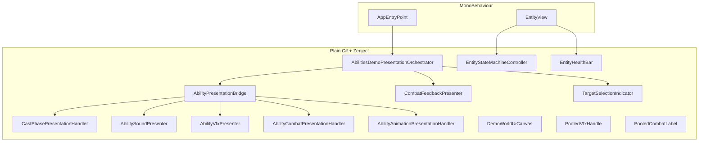

# Abilities Architecture

This document describes how the Abilities feature is structured in `Assets/_Project/Source/Modules/Core/Abilities/`.

## Goals

- **Data-driven abilities** — designers configure abilities via ScriptableObjects without code changes.
- **Testable core** — domain and execution logic avoid direct Unity dependencies where possible.
- **Modular integration** — the feature plugs into the project module system (Zenject + `IModule`).

## Layers and Assemblies

| Assembly | Role | Unity refs |
|---|---|---|
| `Abilities.Domain` | IDs, enums, events, ports, entity contracts | No (`noEngineReferences`) |
| `Abilities.Data` | `AbilityConfigAsset`, component data (`[SerializeReference]`), `AssetReference*` authoring, `AddressableAssetRefUtility` | Yes (ScriptableObject + Addressables types) |
| `Abilities.Execution` | Catalog, mapper, registry, executors, `AbilitiesService`, `AbilityTargetIdResolver` | No (`noEngineReferences`) |
| `Abilities.Infrastructure` | `AbilityPresentationPort` (UniRx subjects) | Yes |
| `Abilities` | `AbilitiesModule`, installer, update handler | Yes |

Related game module:

- `AbilitiesDemo` — 3D demo scene, keyboard input (keys 1–4), `AbilitiesDemoPresentationOrchestrator` (plain C#), presentation bridge, world UI, object pooling for float text and VFX.

## Presentation layer (AbilitiesDemo)



`AbilitiesDemoModule` creates an empty `AbilitiesDemoWorld` root (no gameplay `MonoBehaviour`), resolves services from Zenject, and constructs `AbilitiesDemoPresentationOrchestrator`. `Disable()` calls `orchestrator.Dispose()`.

## Module Pattern

`AbilitiesModule` implements `IModule`:

1. **Initialize** — `AbilitiesInstaller.Install` registers Zenject bindings.
2. **Enable** — registers `AbilitiesUpdateHandler` on `LifeCycle`.
3. **Disable / Shutdown** — unregisters update handler and clears state.

Dependencies: `Logger`, `LifeCycle`.

## Key Patterns

### Component registry + executors

Each ability is a list of `IAbilityComponentData` entries. At runtime:

1. `AbilityConfigMapper` converts `AbilityConfigAsset` → `AbilityDefinition`.
2. `AbilityCatalog` stores definitions by `AbilityId`.
3. `AbilityExecutor` groups components by `AbilityPlayTimeType` (`OnStart`, `Delay`, `OnEnd`).
4. `AbilityComponentRegistry` maps data type → `IAbilityComponentExecutor`.

### Presentation port

Execution never touches GameObjects directly. Executors call `IAbilityPresentationPort`, implemented by `AbilityPresentationPort` (UniRx observables). `AbilityPresentationBridge` is a thin wiring facade that subscribes to **all** facade streams and delegates to focused handlers: `CastPhasePresentationHandler` (cast phases + input lock release), `AbilitySoundPresenter`, `AbilityVfxPresenter`, `AbilityCombatPresentationHandler` (damage + aim), and `AbilityAnimationPresentationHandler`. Animation/movement gameplay is driven primarily via `IEntityStatePort` (FSM); observables remain the single event bus for tests, replay, and future views.

**Asset boundary:** component data in `Abilities.Data` stores `AssetReference*` (sound, VFX, animation clips). Executors call `Resolve*Key()` / `ResolveAnimationName()` and publish **string** intents (`PresentationSoundIntent`, `PresentationVfxIntent`, etc.). Demo adapters (`IAddressablesFacade`, `IEffectsFacade`) load assets by address at runtime.

`AbilityDefinition` carries SO metadata at runtime: `HotkeySlot`, `TargetType`, `Range` — used by `AbilitiesInputService` and `AbilityCastingService` (no hardcoded ability ids). Component field semantics: [Ability-Config-Reference.md](Ability-Config-Reference.md).

### Entity state port

Executors also call `IEntityStatePort` (implemented in `AbilitiesDemo` as `EntityStatePort`) to transition entity FSM states. See [Entity-StateMachine.md](Entity-StateMachine.md).

### Status effects (FSM)

`StatusEffectComponentExecutor` enters parallel `Status.*` states on the entity FSM with duration payload. DoT/heal ticks run via FSM `OnUpdate` — **`StatusEffectStack` was removed**.

### Cast pipeline

`AbilitiesService.CastAsync`:

1. Validates no active session, known ability, registered caster.
2. Records activation log frames.
3. Runs `AbilityExecutor.ExecuteAsync`.
4. Returns `CastAbilityResult` (`Ok` or `Fail` with `CastAbilityErrorCode`).

## Why Zenject, UniRx, UniTask

| Library | Use in Abilities |
|---|---|
| **Zenject** | Installer wires registry, catalog, service, facade; modules resolve `IAbilitiesFacade`. |
| **UniRx** | `AbilityPresentationPort` exposes intents as observables; `AbilitiesService.PhaseChanged` streams cast phases. |
| **UniTask** | `CastAsync` / `ExecuteAsync` without coroutines; integrates with cancellation tokens. |
| **DOTween** | Demo displacement, health bar tweens, floating combat text. |

## Object Pooling

`PoolModule` exposes `IPoolFacade`. The demo uses it for floating combat numbers (`PooledCombatLabel` in `CombatFeedbackPresenter`) and VFX instances (`PooledVfxHandle` in `EffectsService`), prewarmed at boot via `IPoolFacade.CreatePool`.

## Folder Map

```
Abilities/
  Domain/           Pure types, ports, CastAbilityResult
  Data/             AbilityConfigAsset + component data classes
  Execution/        Service, executor, mapper, executors/
  Infrastructure/   Presentation port adapter
  Installers/       AbilitiesInstaller
  Facade/           IAbilitiesFacade
  AbilitiesModule.cs
```

## Tests

See `Assets/_Project/Tests/`:

- **EditMode/Unit** — registry, executors (including Damage, targeting, animation refs), pool service, logger config, `WaitUntilEnd`, entity FSM status tests.
- **EditMode/Integration** — `AbilityConfigMapper` with mock assets.
- **EditMode/Architecture** — `DomainAsmdefTests`, `ExecutionAsmdefTests` (`noEngineReferences` on Domain + Execution).
- **PlayMode** — `AbilitiesModule` smoke initialization, cast flow, gameplay extensions.
